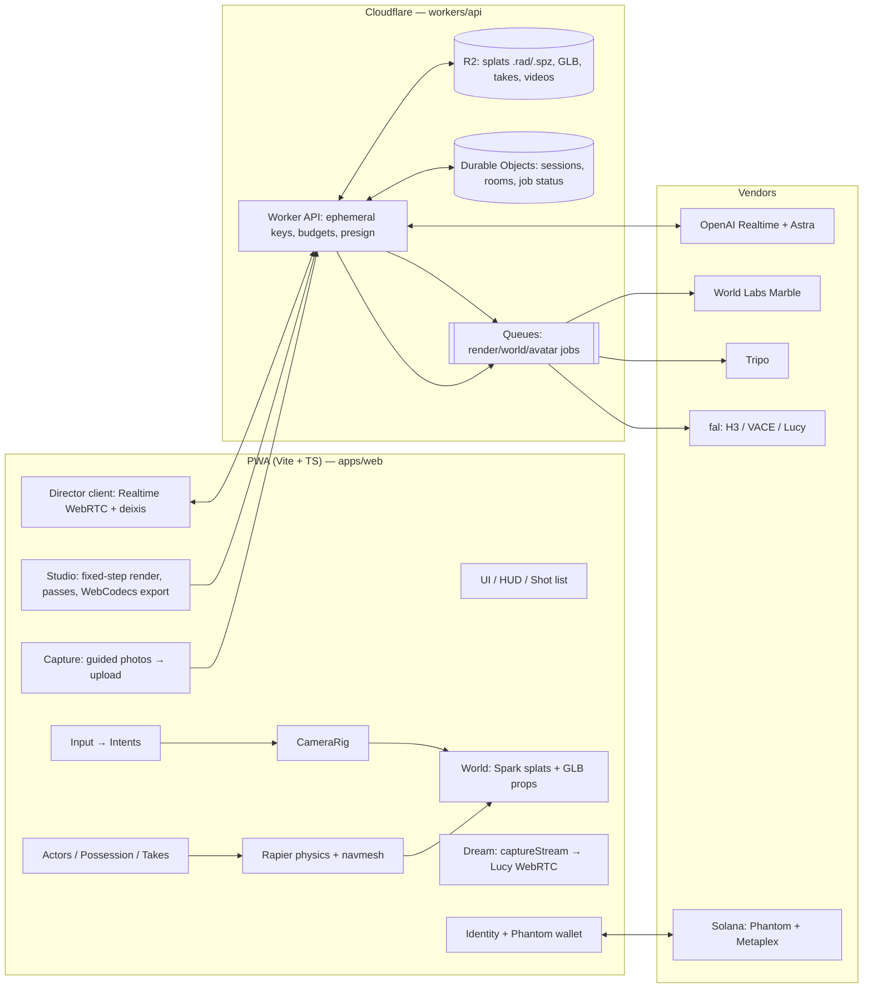

# $COAST the Game — goal.md

**Spec for the build agent (OpenAI Codex running GPT-6 Astra, cloud).**
Version 0.2 · 2026-09-06 · Author: GRATITUD3 / WZRD.tech · Drafted and adversarially reviewed with Claude Fable 5.1 (v0.2 folds in the review: client-stamped deixis, budgeted golden path, M3.5 vertical slice, measurable gates, schemas in §7.16, provisioning checklist D-0)
Repo: `coast-the-game` · License: TBD (code MIT-compatible; art/IP: WZRD.tech)

> Read this file fully before touching code. `AGENTS.md` at the repo root tells you *how* to work; this file tells you *what* to build and *why*. Requirement IDs (`W-3`, `CAM-2`, …) are stable — reference them in commits, PRs, and tests.

---

## 0. North Star

**One sentence:** A web-native, cross-reality game-studio hybrid where you play inside worlds made from your own reality — and every minute you play can become a GTA-grade cinematic clip, set to $COAST's music, that you own on-chain.

**The product moment:** A person scans their block on an iPhone (2 minutes), drops into it as their own avatar or as $COAST (the West Coast rapper mascot), cruises a lowrider through the fog at golden hour, says *"camera low — follow the car — action"*, and 90 seconds later has a 30-second music-video cut they can post and mint. On a Quest 3 the same level is life-size and their hands touch the splats; on a desktop it runs at 60 fps with cinematic post; on a phone it's a magic window plus the capture tool.

**The unifying design idea:** the three perspectives *are* the three film roles, and filming *is* the game.

| Perspective | Role | Verbs |
|---|---|---|
| 1st person (desktop / phone / VR) | **Actor** | move, grab, throw, gesture, perform, talk, touch the world (hands) |
| 3rd person over-the-shoulder / orbit | **Director** | frame, block ("put that there"), cue, action / cut, replay takes |
| Overhead / diorama (VR: tabletop-scale world you reach into) | **Producer** | spawn, arrange, set time/weather, schedule shots, render, publish, mint |

"You overlooking you, guiding yourself" is the emotional core: the player character is an NPC the player can **possess**, **record**, and **replay**. Act a take in 1st person; step out; direct the camera around your own replayed performance; call action. One person becomes a film crew.

**The session output — a *Coast Cut*:** a 15–60 s clip locked to a bar range of a $COAST track, rendered from the game (optionally passed through a generative video model that follows the 3D shot), exported as MP4, shareable, mintable on Solana as the player's IP. Cuts from many players assemble into the crowd-directed $COAST music video. Missions in this game are *shots* ("get a low-angle of the lowrider hopping at the pier at sunset"); completing a mission yields a clip.

**Why it can win awards (Awwwards/FWA/Webby/Three.js showcase bar = Starspeed, Into the Scaniverse, Gracia "Open", IVRESS, Oryzo, Illoca):**
1. Reality → playable level in under 10 minutes from a phone.
2. Possess / record / replay + voice-and-pointing direction ("100× put-that-there").
3. Generative video that *obeys the shot* (depth/pose-conditioned), not slot-machine AI video.
4. Live "dream" restyle of the running game (real-time video-to-video).
5. One codebase, four realities: desktop, iPhone, Quest 3, Vision Pro.
6. Cultural timing: $COAST campaign + GTA VI launch window (Nov 19, 2026).

---

## 1. Assumptions & interpretations (verified 2026-09-06; see `docs/research/`)

| # | Assumption | Consequence |
|---|---|---|
| A1 | "Astra" = OpenAI **GPT-6 Astra** (`gpt-6-astra`; text+image in, text out; 1M ctx; Responses/Realtime; skills, MCP, hosted shell). The build agent is Codex (cloud) running it. | This spec addresses *you*, Astra. Use `high`/`xhigh` reasoning for architecture and visual QA, `medium` for boilerplate. |
| A2 | Codex cloud sandboxes have **no Blender GUI** → Blender MCP (GUI TCP bridge) is for local desktop sessions only. | Asset factory uses **headless `blender -b --python`** (bpy) scripts; MCP path documented as optional. |
| A3 | **Spark 2.1** (`@sparkjsdev/spark`, MIT, World Labs) is WebGL2-only, `three >= 0.180`. three.js r186 has a native WebGPU splat renderer but no LoD/streaming. WebXR on Quest is WebGL2 in production. | Single render path: **three 0.180.x + Spark 2.1 on WebGL2**, everywhere. WebGPU is a 2027 revisit, not a v1 dependency. |
| A4 | **iPhone Safari has no WebXR** (iOS 26.x, Safari 27 beta). visionOS Safari = `immersive-vr` only, gaze+pinch. Quest Browser = full WebXR (hands, anchors, planes/meshes, depth hit-test, passthrough). | iPhone tier = touch + 3DoF magic window + capture tool (+ AR Quick Look for placing single objects). VR tier = Quest 3 first, Vision Pro second. |
| A5 | **World Labs Marble World API** (`api.worldlabs.ai`) generates worlds from text / image / multi-image / video, exports `.spz` (100k/500k/full) **plus a GLB collider mesh** and a 360° pano; ~5 min; ≈$1.2–2.5 per world. **Atlas** is partner-early-access only (no API). | Marble is the base-layer engine. Atlas = upgrade path, not a dependency. |
| A6 | **Tripo v3** API: image/text → 3D (H3.1 PBR ≈40–120 s), auto-rig with `spec: "mixamo"` bone naming, retarget presets (idle/walk/run/jump/dance…), GLB/FBX/USDZ. **HEAT wound down (Dec 2025)**, **Ready Player Me shut down (Jan 2026)**, RADiCAL gone; Mixamo alive but unmaintained. | Characters: Tripo → rig (mixamo spec) → presets; Mixamo FBX → GLB via headless Blender; Meshy as fallback. Never depend on a hosted avatar ID — every rig/clip lives in repo/R2 as GLB. |
| A7 | **MiniMax H3 Max Turbo** (fal) renders a 5 s 768p clip in ≈1.5 s ($0.04/s) — *faster than real time, but clips, not frame streaming*. True live video-to-video = **Decart Lucy 2.5** (720p, 30 fps, <40 ms/frame, WebRTC, $0.04/s on fal). Depth/pose-faithful generation = **Wan 2.2 VACE** (fal). H3 (full) accepts ≤9 reference images + ≤3 reference videos to inherit camera motion. | Story mode has two engines: **Dream (live, Lucy)** and **Cuts (clip queue, H3 Max Turbo / H3 ref-to-video / VACE)**. |
| A8 | **OpenAI Realtime API**: `gpt-realtime-2.1` / `-mini`, WebRTC with ephemeral `client_secrets`, function tools + MCP, image input (no video). ≈$0.05–0.25/min. | Voice director = Realtime + our scene-op tool schema; Astra (Responses API, image input) for shot planning and visual QA. |
| A9 | **Sign in with ChatGPT** grants name/email/avatar only and is partner-gated. **thirdweb** has no Solana *user* wallets (server-side only). WZRD's on-chain IP is on Solana. | Identity: Google/Apple OAuth (+ SIWC if available). Wallet: **Phantom Connect** (embedded Solana wallets, social login). Mint: **Metaplex**. thirdweb only if EVM/x402 is added. |
| A10 | **Cloudflare**: Workers static assets (25 MiB/file cap), R2 (5 GiB single PUT, Range requests, zero egress), Durable Objects, Queues. Workers AI has no 3D models. **ChatGPT/Codex Sites** hosts Cloudflare-Worker-shaped apps. | All splats/videos in R2; API + secrets in a Worker; DO for rooms; Sites as a demo publish target. |
| A11 | **Google Photorealistic 3D Tiles** are usable as a *visual exploration base layer* only: no caching/offline, mandatory attribution, and **you may not derive assets from the tiles**. No web VPS exists (8th Wall shutting down; Niantic VPS native-only). | "Drop a pin" = explore in 3D Tiles → generate the *playable* cell from the user's own photos/text prompts, never from tile captures. Outdoor phone registration is GPS/compass-grade (3–5 m). |
| A12 | **GTA VI** ships Nov 19, 2026 (consoles). No Rockstar creator tooling is announced. | "Use with GTA VI" = (a) players can feed their own GTA VI captures (photos/clips) as *reference* inputs to the video models and as Marble reconstruction inputs; (b) the studio targets GTA-grade cinematic language. No dependency on Rockstar tooling. |
| A13 | "GTA SV" = working title for the one level (read as Silicon Valley / Bay Area). No Tenki sandbox exists; parallelism = multiple Codex cloud tasks. | Level codename **"SV"** = *The Coast Block*, see §8. |

---

## 2. Non-goals (v1)

- No real-time multiplayer gameplay (presence + async sharing only; DO room skeleton allowed).
- No custom game engine, no Unity/Unreal, no native apps (PWA + WebXR only; App Clip via Variant Launch is an *optional* later add-on).
- No open world beyond the one level (hub + 4 cells). No combat. No economy beyond minting.
- No splat *skinning* for characters (Spark's `SplatSkinning` is experimental) — characters are GLB skinned meshes.
- No WebGPU render path in v1. No Atlas dependency. No self-hosted video models in v1 (hosted via fal/Decart; self-host is a documented v2 option).
- No live video input to the LLM (not supported); single image frames per push-to-talk / per act only (DIR-1).
- No dependence on Google 3D Tiles for gameplay geometry, and no derivation of assets from tiles.

---

## 3. Player experience

### 3.1 Golden path (the 7-minute demo — this is what we ship first and polish hardest)

The awards are decided in the first 30 seconds and by one guaranteed "wow" (put-that-there, with a click/tap fallback when voice fails). Polish concentrates there.

1. **Land** (0:00) — `coast.wzrd.tech`. The Coast Block reveals itself with a splat reveal wipe (Spark `splat-reveal-effects` pattern) while the $COAST track's intro plays. One button: **Drop In**. Optional: *Scan your block* / *Make your avatar*.
2. **Drop in** (0:20) — you spawn as $COAST in the Garage hub, golden hour, fog rolling off the water. The billboard on the wall is empty: *"your cut plays here."* **The Photographer** (NPC tutor) walks up and hands you **Mission 1** (a mission card with 3 constraint chips: *low angle · lowrider hop · pier at sunset*) and speaks one example command with subtitles: *"Say: camera low, follow me."* Desktop: WASD + mouse. Phone: dual virtual sticks (portrait 9:16 layout). Quest: sticks or teleport, hands visible.
3. **Play** (1:00) — the lowrider idles by the door. Drive to the pier cell (streams in, no loading screen); NPCs greet you (cached voice lines); hydraulics hop on the beat (space / A / right pinch). Grab a can and tag the wall (SDF splat edit). Touch the fog with your hands in VR.
4. **Direct** (2:30) — `Tab` / wrist button / say *"director"*: the camera slides over your shoulder (250 ms) and the **shot meter** appears (framing · subject · light · beat). Say *"camera low, follow the car"* → rig obeys, meter fills. *"Put that there"* while pointing at the taco truck, then at the pier → ghost preview → truck moves. (Mouse/touch fallback: click the truck, click the spot — the same acts.) *"Action."*
5. **Take** (3:30) — you drive the pier at sunset; the shot records (beauty only during play; passes are re-rendered offline). *"Cut."* The take replays on the billboard with the judge's verdict (★★☆ and one hint: *"camera too high — under 0.6 m"*). Still in Director mode, you re-frame around your own replayed take and call *"take two"* (3 takes max per mission — tension).
6. **Cut** (5:00) — the studio assembles the Coast Cut to bars 9–24 of the track (captions, LUT named by the mission's look), renders a **Turbo** cinematic pass of the best 5 s (H3 Max Turbo, ≈2 s) as the reel thumbnail. *Dream* (live restyle) is a premium toggle with a visible meter — **not** part of the golden path.
7. **Drop** (6:30) — export (MP4 1080p24, 16:9 and 9:16), share page, **Mint** (Phantom). Under 7 minutes; API cost per step: Realtime-mini ≤5 min ≈ $0.40 · Turbo ≤2 drafts ≈ $0.40 · Astra judge 3 keyframes ≈ $0.10 · TTS cached $0 · **≈ $0.90 ≤ QB-10 $1.50**. Hero (H3) and faithful (VACE) renders run **async after the session** and notify.

### 3.2 Core loop

`CAPTURE (optional) → DROP IN → PLAY → DIRECT/TAKE → CUT → DROP (share/mint)` — 5–15 minutes per loop; every loop yields a clip; clips fill the reel bar by bar; missions are shots.

### 3.3 Missions = shots (the GTA analog)

- **MIS-1** A **Mission** is a shot brief with machine-checkable constraints and a named look: `{id, title, trackId, barRange, look, constraints[], hint[], reward}` (schema §7.16). Example: *"Verse 2, bars 1–8 — low-angle tracking shot, lowrider hop, pier, sunset, fog."*
- **MIS-2** The **shot meter** shows live, before "action", how the current frame scores on each constraint (camera height/angle band, subject in frame ≥ N% of duration, time-of-day preset, duration within ±10%, beat-sync of the hop). The judge is the same code, run on the recorded take; Astra (image input) grades *only* aesthetics on 3 keyframes (0–10) and never decides pass/fail.
- **MIS-3** Verdict = ★1–3 with one actionable hint per failed constraint (numeric: *"camera too high — under 0.6 m"*). 3 takes per mission; best take counts.
- **MIS-4** Rewards & progression: stars unlock outfits, lenses (24/35/50/85), hydraulic patterns, time presets, and NPC cameos; the **reel** is a music-video timeline that fills bar by bar as missions complete (12 missions ≈ the full track).
- **MIS-5** 12 missions ship in v1: **agent-authored via the planner (DIR-5) at build time, human-approved** (GRATITUD3 signs off the 12 in M5). Runtime-generated missions are v1.5.
- **MIS-6** The mission names the look (LUT + Turbo style preset); Dream is a 3-preset premium toggle, never a mission requirement.

### 3.4 The three perspectives (CAM-*)

- **CAM-1** One `CameraRig` with modes `actor | director | producer`, sharing a `target` (the possessed `Actor`). Transitions tween rig parameters (distance, height, shoulder offset, FOV, damping) in ≤300 ms with no frame >50 ms; no loading, no scene swap.
- **CAM-2** `director` sub-modes: over-shoulder (left/right), orbit (OrbitControls-like around the target's feet, as in `third-person-controller-splat`), locked shot (rig follows a keyframed path).
- **CAM-3** `producer` = overhead orbit on desktop/phone; **in VR = diorama**: the *scene root* (cell + actors + props) is scaled to 1:12 on a virtual table in front of the user (Spark supports uniform `SplatMesh` scale); **physics is paused** while in diorama; hands pick/place actors and props and positions are written back at 1:1 on exit. Switching back to actor scales the world to 1:1 around the target with a 400 ms fade.
- **CAM-4** In XR the rig moves Spark's `localFrame` group (camera parent), never the camera itself; comfort: vignette on locomotion, snap-turn default, teleport available.
- **CAM-5** Mode switching: `Tab` cycles modes; `V` toggles shoulder side; phone: two-finger swipe down/up; VR: **wrist menu button** (no gesture is overloaded — see INP-5); voice: "director / actor / producer".
- **Role partition (CAM-8):** each mode exposes its own verbs (and only those tools to the voice director, DIR-2): **Actor** = body (move, grab, gesture, perform, talk); **Director** = camera + performance + record (camera, follow, play_anim, possess, replay_take, record, mark_beat); **Producer** = world state + shot list + export/mint (spawn, move, rotate, scale, delete, set_material, group, set_time, set_weather, cut/export). "Put that there" is therefore a Producer act; the Director can still say it — the runtime switches to Producer for that act and back (a 250 ms transition), which is what a film crew does too.

### 3.5 Possess / record / replay (ACT-*)

- **ACT-1** `Actor` = GLB skinned character + `Controller` slot: `PlayerInput | AIBehavior | Replay`. The player character and NPCs are the same class.
- **ACT-2** **Record** captures a *Take*: root transform (f32 pos + 16-bit quat) and bone quats (16-bit, delta-keyframed, only bones that moved > 0.5°) at 30 Hz, plus the input intents and a **world-edit log** (SDF tags, grabbed/thrown props with their rigid-body poses) so a replay repaints the wall and re-throws the can. Budget ≤1 MB/min (80 bones × 16-bit × 30 Hz ≈ 0.6 MB/min before delta). **Poses are authoritative** — replay never re-simulates the character. **Replay** drives the actor from a Take. Multiple actors can replay concurrently (multi-take blocking).
- **ACT-3** **Possess** swaps the controller of any `Actor` (including NPCs) to `PlayerInput` — the camera rig re-targets. Unpossessed player actors idle/loiter via `AIBehavior`.
- **ACT-4** Takes are saved to the session (IndexedDB) and R2 when signed in; a Take references the cell version (`cell.json.version`) so replays stay valid.

---

## 4. Quality bar & gates (QB-*)

| ID | Gate | Desktop (Chrome/Edge, RTX 3060-class / M2) | Quest 3 (Browser) | iPhone 15+ (Safari 26) | Vision Pro (Safari) |
|---|---|---|---|---|---|
| QB-1 | Frame rate (p95 over a 90 s scripted route, `/perf` report) | 60 fps @1080p | 72 Hz stereo, frame ≤13.7 ms | 30 fps min, 60 target | 90 Hz target, ≥72 sustained |
| QB-2 | Splat budget (Spark `lodSplatCount`) | 2.5M | **750K, `maxStdDev=√5`, FFR, framebuffer scale 0.7** — raise to 1M / 0.8 only with `/perf` evidence | 750K, pixelRatio ≤1.5 | 750K |
| QB-3 | First interactive frame (`performance.mark('coast:interactive')` when the 100k splats render and input is live; 10 Mbps throttled) | ≤5 s | ≤8 s | ≤8 s | ≤8 s |
| QB-4 | Perspective switch (`coast:mode-start` → `coast:mode-end`, plus max frame during) | ≤300 ms, no frame >50 ms | same | same | same |
| QB-5 | Voice command → **ghost/highlight visible** (PTT release → first act preview; `coast:ptt-release` → `coast:act-preview`, median over the voice suite) | ≤1.2 s | ≤1.5 s | ≤1.5 s | ≤1.5 s |
| QB-6 | Deixis resolver precision on the **fixture suite** (`tests/fixtures/deixis/*.json`, ≥60 cases, unit-tested, no vendor calls) | ≥0.9 with pointer/hand ray; ≥0.7 head-ray/selection-only | | | |
| QB-7 | Capture → playable cell (upload start → first frame of the new cell, runtime `lod:true` on the 500k spz) | ≤10 min end-to-end (Marble ≈5 min) | | | |
| QB-8 | Selfie → rigged avatar in game (with the 6 onboarding clips; the rest retarget async) | ≤4 min | | | |
| QB-9 | Coast Cut (30 s, 1080p24, game render + ≤2 Turbo drafts) record → final MP4 | ≤3 min; hero/VACE renders are async and excluded | | | |
| QB-10 | API cost per golden-path session (ledger, §3.1 step 7 table) | ≤$1.50 (hard cap $3 via Worker budget) | | | |
| QB-11 | Lighthouse Perf / A11y + PWA installability (manifest + SW audit) | ≥85 / ≥90 / installable | | | |
| QB-12 | Visual match to approved concept art: **6 named shots** (`docs/shots.md`: garage-golden, pier-golden, alley-blue, rooftop-night, lookout-fog, lowrider-hero), graded 0–10 by Astra vision against a written rubric (palette, light direction, fog density, silhouette read, material response), **and** GRATITUD3 spot-checks 2 of 6 per milestone | ≥8 on all 6 | | | |

Anything below the gate blocks the milestone. Perf is measured on real devices via the `/perf` route (§7.14) — headless SwiftShader numbers are *not* accepted as perf evidence. While a device gate is pending, the agent continues with non-gated requirement IDs (never idles).

---

## 5. Platform matrix (PLT-*)

| Capability | Desktop | Quest 3/3S | iPhone | Vision Pro | Android Chrome (bonus) |
|---|---|---|---|---|---|
| Renderer | WebGL2 + Spark | WebGL2 + Spark (WebXR) | WebGL2 + Spark | WebGL2 + Spark (WebXR `immersive-vr`) | WebGL2 + Spark (+`immersive-ar`) |
| Input | KB/M, gamepad, webcam hands (MediaPipe) | controllers, **WebXR hands**, voice | touch sticks, gyro look, voice, webcam hands | gaze+pinch (`transient-pointer`), voice | touch, `immersive-ar` hit-test |
| Perspectives | all 3 | all 3 (producer = diorama) | all 3 (producer = overhead) | all 3 | all 3 |
| Capture | upload photos/video | passthrough room scan (planes/meshes) + photos via phone | **guided photo capture** (primary) | — | guided capture |
| Grounding | map pin → 3D Tiles explore | anchors (≤8/site), planes/meshes, depth hit-test | GPS + compass + DeviceOrientation (coarse), QR beacon | — | ARCore hit-test/anchors |
| Story mode | Dream (live) + Cuts | Cuts (Dream experimental) | Cuts | Cuts | Cuts |
| Post-processing | full (bloom, DoF, grade) | minimal (grade only) | grade only | grade only | grade only |

- **PLT-1** Capability detection at boot → `tier` ∈ {desktop, quest, iphone, visionpro, android, fallback}; every subsystem reads budgets from `packages/engine/src/platform/budgets.ts`, never hard-codes.
- **PLT-2** All input devices produce **Intents** (§7.5); gameplay code never reads raw devices.
- **PLT-3** Firefox / unknown GPUs get the `fallback` tier (500K splats, no post).

---

## 6. Architecture



**Monorepo (pnpm workspaces)**

```
coast-the-game/
  goal.md  AGENTS.md  README.md  .env.example
  apps/web/            Vite + TS PWA (the game/studio client)
  packages/engine/     platform tiers, world loading (Spark), physics, actors, camera rig, intents
  packages/director/   scene-op schema, deixis resolver, Realtime client, Astra planner client
  packages/studio/     takes, shot recorder, passes, WebCodecs export, cut assembly
  workers/api/         Cloudflare Worker (Hono): auth, ephemeral keys, budgets, presign, jobs, DO, Queues
  tools/assets/        headless Blender scripts, Tripo/Marble/fal job runners, gltf pipeline, LoD build
  art/                 concept art, style sheets, UI kit (approved outputs, small files only)
  assets/              small GLB/KTX2/audio (≤ 5 MB each; larger → R2, referenced by manifest)
  docs/                ADRs, platform matrix, API notes, research
  skills/              vendored SKILL.md files for Codex (fal-*, ffmpeg, threejs-*, cinematography, solana…)
  tests/               unit (vitest) + e2e (Playwright + SwiftShader screenshots)
  scripts/             setup.sh (Codex env), build-lod.sh, deploy.sh
```

**Data flow rules**
- Large binaries never enter git: `.rad/.spz/.glb > 5 MB`, videos, takes → R2 with content-hash keys; `assets/manifests/*.json` maps logical IDs → R2 URLs + hashes.
- Secrets only in the Worker (`wrangler secret`) and Codex environment secrets; the client only ever holds ephemeral tokens.
- Every vendor call goes through the Worker with a per-session **budget ledger** (QB-10).

---

## 7. Subsystem specifications

### 7.1 World layer — splats (W-*)

- **W-1** `three@0.180.0` (exact pin) + `@sparkjsdev/spark@2.1.x`. Use `SparkRenderer` with `enableLod: true`, `SplatMesh({ url, lod: true })` for dev and for **user-captured cells at runtime**, and **prebuilt `.rad` (`build-lod --quality --rad-chunked --max-sh=1`) with `paged: true`** for shipped cells (agent-time only — Workers cannot run `build-lod`). Budgets from `budgets.ts` (QB-2). `antialias: false`, pixel ratio capped per tier. **Code-split**: Spark + three in their own chunk, Rapier and MediaPipe loaded on demand (QB-3).
- **W-2** A **Cell** = one Marble world (or one user capture): `.spz` (100k/500k/full) + `.rad` (shipped cells) + `collider.glb` + `pano.jpg` + `cell.json` (schema §7.16: version, metric scale from `metric_scale_factor`, `ground_plane_offset`, orientation fix, spawn points, zones, transitions, lighting preset). Coordinate convention: **Y-up, metres, right-handed**. **Orientation: rotate, never mirror** — Spark sample assets need a 180° X rotation (`quaternion.set(1,0,0,0)`, see `apps/web/src/main.ts`); load the spz, the collider and the pano together and verify they agree (signage must read correctly). Bake the fix into the shipped `.rad`.
- **W-3** The level = a graph of cells joined by **transitions** (street segments as GLB kitbash + fog volumes) or **portals** (Spark `SparkPortals`, experimental — behind a flag). **Resident set on every tier = the active cell + its nearest neighbour** (`residentCells: 2`); the next cell starts streaming when the player is within 15 m of a transition; the far cell unloads on arrival.
- **W-4** Splat interaction: SDF edits (`SplatEditSdf`) for tagging (paint), holes, dissolve/reveal; dyno `worldModifiers` for fog, time-of-day tint, wind; hand-driven SDF spheres in VR (`examples/webxr`, `lofi` patterns). Never call `SplatMesh.raycast()` per frame — use Rapier casts against the collider; splat raycast only for click-to-pick.
- **W-5** Lighting: splats carry baked light; time-of-day is a *grade* (dyno colour modifier + post LUT + sky dome + GLB prop lighting), with 4 presets: golden, blue hour, night-neon, fog-noon. Props use PBR with an env map rendered from the cell pano (`SparkRenderer.renderEnvMap`).
- **W-6** Google 3D Tiles (via `3d-tiles-renderer`) only in the **Explore** map mode (desktop/phone), with attribution and no caching; never loaded in XR; never used to derive assets.

### 7.2 Physics & navigation (PHY-*)

- **PHY-1** `@dimforge/rapier3d-compat` in the main thread (worker later if needed). World collider = Marble `collider.glb` (or Blender-generated proxy for user scans) → `ColliderDesc.trimesh`. Character = kinematic capsule with Rapier `KinematicCharacterController` (autostep 0.4/0.2, snap-to-ground 0.5, slope 50°) — copy the pattern from `third-person-controller-splat/src/main.ts`.
- **PHY-2** Props: dynamic rigid bodies with convex hulls (from GLB, computed at import via `gltf-transform` metadata or runtime hull). Grab = kinematic attach; throw = velocity from hand/camera motion history (last 100 ms).
- **PHY-3** One vehicle: the **lowrider** — Rapier raycast-vehicle (4 wheel rays), arcade tuning, **hydraulics**: per-corner spring offsets driven by input or by the track's beat grid (`music.beats[]`), hop = impulse. Enter/exit, camera follow, engine/hydraulic audio.
- **PHY-4** NPC navigation: navmesh per cell baked from the collider (`recast-navigation-js`), crowd agents with loiter/patrol/approach behaviours.
- **PHY-5** Collider alignment is a first-class tuning step: `tools/assets/align-collider.ts` renders splat depth (Spark depth modifier) and collider depth (`MeshDepthMaterial`) from **6 named 512×512 views** per cell (`cell.json.alignViews`), and reports the **share of valid pixels with |Δdepth| > max(0.15 m, 2% of depth)**; CI fails a shipped cell above **3%**. For user-captured cells the same check runs **client-side** at reduced resolution and only warns.

### 7.3 Characters (CHR-*)

- **CHR-1** Skeleton standard: **Mixamo bone naming** (Tripo `spec: "mixamo"`), 1 unit = 1 m, T-pose rest, root motion off (in-place), ≤80 bones, ≤30k tris hero / ≤12k NPC, 2K PBR (KTX2).
- **CHR-2** Clip set (named, looped where marked): `idle*`, `walk*`, `run*`, `jump`, `fall`, `land`, `sit`, `wave`, `point`, `nod`, `talk_a/b`, `dance_a/b`, `rap_a/b/c` (rap = video→mocap of a real performance, or SayMotion text-to-motion fallback), `drive_idle`, `drive_turn`. Crossfades via `AnimationMixer`; a state machine in `packages/engine/src/actors/anim.ts`.
- **CHR-3** **$COAST hero**: modeled from the campaign's character sheets (see `art/style/coast-character.md`); produced via Tripo H3.1 from 3 turnaround concept images → auto-rig → presets; cleaned in headless Blender (materials, eye/teeth, cap/chain props). Ship 3 outfits.
- **CHR-4** **Player avatar** (selfie → avatar, QB-8): guided selfie (face + optional full-body) → Tripo image-to-3D (stylized prompt to match the art direction) → Rig Check → Auto-Rig (mixamo) → retarget the shared preset set → `gltf-transform optimize` → R2. Fallback: pick from 8 pre-made stylized avatars; "randomize" mixes head/body/outfit parts. Likeness is stylized on purpose (no photoreal face scans in v1).
- **CHR-5** NPC cast (v1): the OG on the corner, skater kid, taco-truck vendor, DJ at the pier, a fan with a phone, the photographer (gives shot missions), a dog. Each has a persona file, 3 idle behaviours, a cached dialogue graph (§7.12).

### 7.4 Camera rig — see CAM-1…CAM-5 and CAM-8 (§3.4).

Additional: **CAM-6** cinematic controls exposed to the director tools: `shot` presets (wide/medium/close/low/high/dutch), `follow(target, offset, damping)`, `dolly/orbit/crane` moves with duration, `lens` (FOV 18–85 mm equivalents), DoF via Spark `focalDistance/apertureAngle` on desktop, `lookAt` with lead. **CAM-7** Keyframed camera paths (`CatmullRomCurve3` + easing; optional Theatre.js) stored in the Shot; scrubbable.

### 7.5 Input → Intents (INP-*)

- **INP-1** Intent set: `move(vec2)`, `look(vec2)`, `jump`, `sprint`, `interact`, `grab/release(hand)`, `point(ray, hand)`, `select(ray)`, `pinch(hand, strength)`, `gesture(name)`, `speak(audioTrack)`, `menu`, `modeCycle`, `vehicle.{throttle,steer,brake,hop}`.
- **INP-2** Providers: keyboard/mouse (pointer lock), touch (dual virtual sticks — port `examples/mobile-joystick`), gamepad, WebXR controllers (Spark `SparkXr`/`FpsMovement` sticks), **WebXR hands** (pinch = grab/select, index ray = point, 25 joints), **MediaPipe Hand Landmarker** in a Worker (webcam/phone: 21 landmarks → screen-space ray + pinch), voice (Realtime).
- **INP-3** A **deixis buffer** (4 s ring) records `(t, pointerRayHit, handRayHit, headRayHit, selection, pinchStrength, clickEdge)` at 30 Hz for the director (§7.6). "Gaze" on Vision Pro is a head ray (no eye data reaches the page) and is treated as such everywhere.
- **INP-4** Accessibility: remappable keys, hold/toggle options, subtitles for all voice, reduced-motion mode (no camera shake, instant transitions).
- **INP-5** VR gesture map (no overloading): **left pinch-and-hold = talk (PTT)**; **right pinch = grab / select / "point at that"**; right index ray = pointing; wrist menu button = mode switch; palm-pinch is reserved by the system. Controllers: grip = grab, trigger = select/point, A/X = jump/hop, thumbstick click = PTT, menu = modes.

### 7.6 Director AI — "100× put that there" (DIR-*)

- **DIR-1** Transport: browser ↔ OpenAI Realtime via **WebRTC**; the Worker mints ephemeral client secrets (`POST /v1/realtime/client_secrets`), never exposing the API key. Model `gpt-realtime-2.1-mini` by default, `gpt-realtime-2.1` for premium sessions. **Push-to-talk** (hold `T` / thumbstick click / left pinch-and-hold); on release the client commits the audio buffer immediately (no VAD tail) and stamps the **speech window** `{startMs, endMs}` from `input_audio_buffer.speech_started/stopped` (or the PTT press/release). Vision: **one 512-px JPEG per PTT press and one per committed act** as `input_image` (never a stream); older image items are deleted from the conversation after each act so the 128K context stays small. The scene summary JSON (≤2 KB) is the model's primary context, refreshed on change.
- **DIR-2** Tool schema (JSON in `packages/director/src/schema.ts`; *query* vs *act* tools; **only the active mode's tools are exposed** (CAM-8), the rest are hidden per `session.update`; acts are idempotent via the Realtime **`call_id`** (the model never invents ids); each returns `{ok, affected[], preview_thumb?, confidence, question?}`):
  - query: `query_scene(filter)`, `resolve_ref(ref) → candidates[]`, `get_shot_state()`, `list_assets(query)`
  - act: `spawn(asset|prompt, place, scale?, tags?)`, `move(obj, place, animate_ms?)`, `rotate(obj, yaw|face:ObjectRef)`, `scale(obj, factor|size_m)`, `delete(obj)`, `set_material(obj, color|preset|prompt)`, `group/ungroup`, `set_time(preset|hour)`, `set_weather(fog|clear|rain)`, `play_anim(actor, clip)`, `possess(actor)`, `replay_take(take, actor)`, `camera(shot|follow|move…)` (CAM-6), `record(start|stop)`, `mark_beat(label)`, `undo(n)`
  - refs: `ObjectRef = {id} | {deictic:"that|this|it", ordinal?} | {desc:"the red car", near?:ObjectRef}`; `PlaceRef = {pos} | {deictic:"there|here", ordinal?} | {relative:{to:ObjectRef, rel:"left|right|behind|in_front|on_top|inside|next_to", distance_m?}}`. **The model never supplies timestamps** — it has no clock and Realtime gives no word timings; it passes the deictic word and its ordinal within the utterance (1st "that", 2nd "that"…). The client attaches the speech window to the call.
  - JSON schema uses `anyOf` + `$defs` (no `oneOf`, no recursion) and is validated client-side (zod) before execution.
- **DIR-3** Deixis resolution (client-side, deterministic, unit-tested against `tests/fixtures/deixis/*.json`): given the speech window `[start, end]` and the deictic's ordinal `k` of `n` in the utterance, the nominal time is `t_k = start + (end − start)·k/(n+1)`; the resolver then prefers, inside `[t_k − 700 ms, t_k + 700 ms]`, an **explicit pointing event** (pinch peak, click edge, controller trigger) and otherwise the sample nearest `t_k`, with source priority **hand/controller ray > pointer > head ray > current selection > last-mentioned**; for "there/here" the ground/navmesh hit at that time snapped to surfaces; relations resolved in the *speaker's* frame; ambiguity → highlight top-2 candidates and ask a one-word question; every act shows a **ghost preview** for 600 ms before committing (skip if `confidence ≥ 0.9` and non-destructive); `undo` always available. Destructive acts (`delete`, `scale > 3×`) require confirmation below 0.8 confidence. **Mouse/touch fallback** (click object → click place) produces the same acts with `confidence 1`.
- **DIR-4** Spoken grammar (documented in `docs/director-grammar.md`): verb + object + place, plus camera vocabulary (wide/medium/close, low/high, follow, orbit, push in, pull out, crane up, dutch), and studio words (action, cut, take two, playback, slate). The model is instructed with the grammar, the scene summary (≤2 KB, refreshed on change), and the active mission brief.
- **DIR-5** Astra (Responses API, `gpt-6-astra`, image input) is the **planner**: converts a mission or a free-form idea into a shot list (JSON), scores takes against the brief (3 keyframes), and writes the caption/credits. Never on the hot path.
- **DIR-6** Cost/latency: cap Realtime sessions at 20 min with silent reconnect; verbosity cap in instructions; cache tool results; budget ledger increments per minute. Tests use a **`FakeRealtime`** transport that replays recorded JSON event transcripts (`tests/fixtures/realtime/*.json`) so the voice suite costs $0 per PR; a nightly e2e job runs 10 utterances against the real API.

### 7.7 Studio — takes, shots, export (STU-*)

- **STU-1** **Shot** = camera path + duration + fps + passes + participating takes. **Simulation always runs at a fixed 60 Hz** (36 Hz in VR when needed) with render interpolation, live and offline; **export is 30 fps** (every 2nd sim step; 24 fps is derived by re-timing the 120 Hz-equivalent pose stream, never by re-simulating). Replays drive actors from **authoritative poses** (ACT-2); dynamic props are recorded during the take and replayed kinematically. The live view shows a 1× preview; export renders at 1080p (4K optional, desktop only).
- **STU-2** Passes: `beauty` (with post) always; **control passes only for the ≤5 s spans sent to a faithful render** and at **≤720p, 8-bit, as short MP4/WebM control videos**: `depth` (linearized, 8-bit with a per-clip near/far in `camera.json`), `pose` (2D OpenPose-style skeleton), optional `normal`/`id` for compositing; `camera.json` (intrinsics/extrinsics per frame). Depth for splats via Spark's depth modifier / `render-cube-depth` pattern; for meshes via depth texture. No 16-bit PNG sequences (a 30 s cut would be ~1 GB).
- **STU-3** Encode video with **Mediabunny** (WebCodecs, H.264) client-side; **audio is muxed server-side in v1** (WebCodecs AAC is unavailable on Linux Chrome and uneven on Android/Safari): the client uploads the video track + the cut JSON, a job composes music/captions via fal `ffmpeg-api/compose` (Cloudflare Containers running ffmpeg is the v1.5 self-hosted path). Upload to R2 via presigned multipart.
- **STU-4** **Cut assembly**: timeline = bars of the selected $COAST track (beat grid JSON per track in `assets/music/*.beats.json`); clips snap to bars; auto-captions (lyrics timed); colour LUT named by the mission's look; export 16:9 and 9:16 (portrait is the phone's default).
- **STU-5** Every exported Cut carries a **provenance manifest** (cell versions, takes, shots, prompts, model IDs, seeds, cost, bar range, user-supplied reference media) — this becomes NFT metadata.

### 7.8 Generative video — Dream & Cuts (GEN-*)

| Mode | Engine (via fal unless noted) | Input from the game | Latency | Cost | Use |
|---|---|---|---|---|---|
| **Dream (live)** | Decart **Lucy 2.5** (WebRTC, direct SDK or fal) | `canvas.captureStream(24)` at 1280×720 + style prompt | <100 ms/frame | ≈$2.40/min | story mode on desktop; experimental on Quest |
| **Cuts — draft** | **MiniMax H3 Max Turbo** I2V | first frame of the shot (+ prompt from scene summary) | ≈1.5 s per 5 s clip | $0.04/s | instant previews, mission feedback |
| **Cuts — faithful** | **Wan 2.2 VACE** (depth / pose) | depth + pose control videos from STU-2, beauty ref frame | 30–90 s per 5 s | ≈$0.1–0.3/clip | shots that must follow the camera/blocking exactly |
| **Cuts — hero** | **MiniMax H3** reference-to-video | beauty clip as reference video (camera inherit) + ≤9 refs ($COAST sheets, cell pano crops) | 1–3 min | $0.13/s at 2K | final music-video-grade clips |
| (v2) | World Labs **Atlas** (camera-path native) | posed keyframes + camera.json | — | — | when API access lands |

- **GEN-1** All jobs run through `workers/api` → Queue → fal; the client polls DO job status; results land in R2; the in-world billboard and the shot list show them.
- **GEN-2** Prompts are *composed*, never free-typed by the model at runtime: `style preset (from art direction) + scene summary (cell, time, weather) + subject sheet ($COAST / avatar descriptors) + shot language (from CAM-6 params)`. Prompt templates live in `packages/studio/src/prompts/`.
- **GEN-3** Identity consistency: $COAST reference sheet images are attached to every hero job; player avatars attach their 3 turnaround renders.
- **GEN-4** Players may attach their own reference media (e.g., GTA VI captures) as reference images/videos — never as training data, always labelled in provenance.
- **GEN-5** Dream mode UI: the film layer renders full-frame with the game underneath at 25% opacity toggle; prompt changes debounce 300 ms; **3 presets** (*35 mm dusk*, *VHS 1994*, *noir*); a visible cost meter; desktop tier only; **premium/out of the golden path** (≈$2.40/min); dev testing capped at 2 min/day. Abort on packet loss >5%.
- **GEN-6** Golden-path policy: during a session only **Turbo drafts** run synchronously (≤2 per mission); **faithful (VACE) and hero (H3) renders are queued after the session** and notify the player (push/email/share page) — their 30–180 s latencies never sit inside the 7-minute path.

### 7.9 Capture & onboarding (CAP-*)

- **CAP-1** Onboarding = 3 optional cards: **Avatar** (selfie → CHR-4, or randomize), **Objects** (photo → Tripo prop with collider; placed into inventory), **Your Block** (guided capture → Marble). Skippable; the golden path needs none of them.
- **CAP-2** Guided capture (phone-first, also desktop upload): 8–24 photos with on-screen azimuth prompts (Marble `multi-image` takes `azimuth` per image), exposure/blur checks, a progress ring; or a 20–60 s video (Marble `video`). Upload via presigned multipart; job → Marble `worlds:generate` (`marble-1.1`), poll `operations/{id}` (~5 min); export `splats` (spz 500k + full) and the **free collider GLB** (never buy the HQ mesh for a user cell); the Worker writes `cell.json`; **the client loads the 500k spz with runtime `lod: true`** and runs the alignment check client-side (PHY-5, warn-only). `.rad` builds are agent-time for shipped cells only (Workers cannot run `build-lod`).
- **CAP-3** Quest: passthrough room capture (`initiateRoomCapture`, planes/meshes) gives a collider + anchors; the user's phone scan (or Marble text prompt) supplies the splats; a 3-point alignment UX (touch three corners) registers the splat to the room.
- **CAP-4** **WZRD.tech profile ingest** (optional): `ProfileProvider` interface (`packages/engine/src/profile/`) with a WZRD adapter reading display name, avatar image, style tags, wallet address, catalog of the user's WZRD media; the concrete endpoint is supplied by GRATITUD3 (open decision D-4). Never blocks onboarding.
- **CAP-5** Sign-in: Google/Apple OAuth via the Worker; **Sign in with ChatGPT** as an additional provider if partner access is granted (D-5). Guest mode always works (session in IndexedDB).

### 7.10 Grounding & localization (GRD-*)

- **GRD-1** Desktop/phone **Explore** mode: map pin → Google 3D Tiles fly-through (W-6) → "claim this block" → the user scans it (CAP-2) or prompts Marble with text + their own photos. Tile imagery is never captured or used as a generation input.
- **GRD-2** Quest: WebXR anchors (≤8 per origin), plane/mesh detection, depth hit-test for placement; cell registration persists per site.
- **GRD-3** Phone outdoors: GPS + compass + `DeviceOrientation` (secure context, permission on gesture) for coarse (3–5 m) alignment in magic-window mode; **QR/image-target beacons** (8th Wall MIT image targets, self-hosted) for local re-registration at a mission spot. No promise of cm-level registration on the web.
- **GRD-4** Android Chrome bonus: `immersive-ar` with hit-test/anchors reuses the Quest code path.

### 7.11 Identity, IP, minting (ID-*)

- **ID-1** Wallet: **Phantom Connect** (embedded Solana wallets with Google/Apple login; existing Phantom users connect directly). Sign-in-with-Solana message for session binding.
- **ID-2** Mint a Coast Cut as a Solana NFT via **Metaplex Core** on devnet now (switch to Token Metadata only if D-6 says a marketplace requires it): asset = MP4 in R2 + IPFS pin (provider: Pinata or web3.storage — secret `IPFS_TOKEN`, D-0), metadata = STU-5 provenance + $COAST track bar range + cell IDs; royalties/splits per WZRD on-chain IP rules (D-6). Mainnet behind a flag and a stop-and-ask.
- **ID-3** Share page `/c/{cutId}`: OG video, provenance, "remix this shot" (loads the shot + world for the visitor).
- **ID-4** thirdweb is *optional* (EVM/x402 payments only); do not build on it for Solana.

### 7.12 NPCs, dialogue, audio (AUD-*)

- **AUD-1** Dialogue: build-time pre-generated graphs per NPC (topics × 3 variants × 3 moods) with cached TTS (ElevenLabs Flash or OpenAI TTS) as Opus in R2; live free-text replies go **through the Worker** (text model `gpt-5-mini`-class via Responses + ElevenLabs Flash TTS — never a second Realtime session) with a 2-sentence cap and a response cache keyed on `(npc, normalized_intent, world_state_hash)`. NPC priority when `maxNpcs` is below the cast size: Photographer > OG > DJ > vendor > fan > skater > dog.
- **AUD-2** Music: the $COAST catalogue (WAV/Opus in R2 + `.beats.json` bar/beat grids). Beat grid drives hydraulics, NPC dance, reveal effects, and the Cut timeline. Provide 2 tracks in v1 (D-7).
- **AUD-3** SFX: footsteps by surface (from `id` pass materials), lowrider engine/hydraulics, ambience per cell (waves, traffic, seagulls), UI. Spatial audio via `PositionalAudio`. Generated with ElevenLabs SFX where no library asset exists; catalogued in `assets/audio/manifest.json`.

### 7.13 UI / UX / PWA (UX-*)

- **UX-1** Art-directed HUD: minimal, diegetic where possible (the shot list is a clapperboard; the billboard plays takes). Typography and colour from `art/style/ui-kit.md`.
- **UX-2** PWA: installable, offline shell, service worker caches app + last cell's 100k `.spz` for instant re-entry. Manifest, icons, splash.
- **UX-3** Loading choreography: pano skybox first (from Marble `pano_url`) → 100k splats → 500k → `.rad` streaming; reveal wipe synced to music.
- **UX-4** Onboarding cards, mission cards, share page, mint flow — each ≤3 taps.

### 7.14 Backend — Cloudflare (BE-*)

- **BE-1** `workers/api` (Hono + TypeScript): `/auth/*`, `/realtime/secret`, `/jobs/{world|avatar|prop|video}`, `/upload/presign`, `/cuts/*`, `/perf/report`, `/budget`. Bindings: R2 (`coast-assets`, `coast-user`), DO (`Session`, `Room`, `Job`), Queues (`jobs`), KV (config), secrets (`OPENAI_API_KEY`, `WORLDLABS_API_KEY`, `TRIPO_API_KEY`, `FAL_KEY`, `DECART_API_KEY`, `ELEVENLABS_API_KEY`, `GOOGLE_MAPS_API_KEY`, `HELIUS_RPC_URL`).
- **BE-2** Budget ledger per session/user (QB-10): every vendor call debits; hard-stop with a friendly UI at the cap.
- **BE-3** `/perf/report` collects `{tier, device, fps p50/p95, frame-time histogram, splatCount, memory, cell}` from real devices; a dashboard page `/perf` shows the latest per device; CI posts a summary to the PR.
- **BE-4** Static assets via Workers static assets (≤25 MiB/file); everything larger in R2 with Range support (Spark `.rad` paging requires it). Secondary publish target: ChatGPT/Codex **Sites** for demo builds.

### 7.15 Asset factory (agent-time) (AF-*)

- **AF-1** Every asset is produced by a **job spec** in `tools/assets/jobs/*.json` (`{id, type: concept|texture|tripo|marble|blender|convert|lod|audio, inputs, params, outputs}`) run by `pnpm assets run <id>`; outputs are content-hashed, uploaded to R2, and registered in `assets/manifests/`. Jobs are independent → run many in **parallel Codex tasks** without merge conflicts (one manifest file per job).
- **AF-2** Concept art & textures: Codex `imagegen` system skill (`image_gen` tool; `scripts/image_gen.py` fallback) → `art/concept/`, `art/textures/` with a prompt log. Style-locked prompts from `art/style/STYLE.md`.
- **AF-3** Headless Blender (5.2 LTS, `blender -b --python`; `bpy` wheel or tarball installed by `scripts/setup.sh`): collider proxies (remesh/decimate from Marble HQ mesh or Tripo mesh), FBX→GLB conversion (Mixamo clips), kitbash street furniture & signage from primitives + generated textures, Cycles CPU bakes, exports with `export_scene.gltf(GLB, draco for static only)`. Blender MCP (official Blender Lab MCP or ahujasid) is optional for local desktop sessions.
- **AF-4** Post: `gltf-transform optimize --compress meshopt --texture-compress ktx2` (UASTC normals, ETC1S albedo); never Draco on skinned meshes; validate with `gltf-validator`; budgets from CHR-1.
- **AF-5** Splat pipeline: Marble export → handedness/scale fix → `spark build-lod --quality --rad-chunked` → R2; user scans (.spz from Scaniverse/Polycam) follow the same path.
- **AF-6** Optional easter egg: `text-to-cad` (build123d) props — "the photographer's tripod", "hydraulic pump" — exported as GLB via `cadgen glb`.
- **AF-7** Decisions that are *not* open (don't bikeshed): Worker framework = **Hono** (the seed's raw handler is replaced in M0); post-processing = the **`postprocessing`** package (not `EffectComposer`); camera keyframes = **own `CatmullRomCurve3` implementation** (no Theatre.js); ECS = a small hand-rolled entity registry (no bitECS in v1); state = plain TS modules + events (no Redux/Zustand); UI = vanilla TS + CSS in `apps/web` (no React); tests = vitest + Playwright (+ **IWER** for headless WebXR); `build-lod` is **downloaded as a prebuilt release binary** (`BUILD_LOD_URL`) and compiled only if that fails.

### 7.16 Schemas the agent needs on day one (SCH-*)

TypeScript sources of truth live next to the code (`packages/engine/src/world/cell.ts`, `packages/studio/src/missions.ts`, `packages/studio/src/index.ts`); these are the shapes:

```jsonc
// cell.json  (SCH-1)  — one per cell, versioned; Takes reference `version`
{ "id": "pier", "version": "2026-09-20.1", "title": "Pier / boardwalk",
  "source": { "kind": "marble", "worldId": "…", "model": "marble-1.1", "promptRef": "art/concept/approved/pier-golden.png" },
  "assets": { "spz100k": "r2://cells/pier/<hash>/pier.100k.spz", "spz500k": "…", "spzFull": "…", "rad": "…/pier-lod.rad", "collider": "…/pier.collider.glb", "pano": "…/pier.pano.jpg" },
  "transform": { "metricScale": 1.83, "groundOffset": -0.42, "rotationEuler": [180, 0, 0] },   // rotate, never mirror
  "spawns": [{ "id": "arrive-from-garage", "pos": [0, 0, 12], "yaw": 180 }],
  "zones": [{ "id": "dj-booth", "kind": "poi", "aabb": [[-3, 0, -8], [3, 3, -4]] }],
  "transitions": [{ "to": "garage", "portal": [[-2, 0, 14], [2, 3, 15]], "streamAt_m": 15 }],
  "lighting": { "preset": "golden", "envmapFromPano": true },
  "alignViews": [{ "id": "v1", "pos": [0, 1.6, 10], "lookAt": [0, 1, 0] } /* ×6 */],
  "budgetOverride": { "quest": { "lodSplatCount": 600000 } } }
```
```jsonc
// level.json (SCH-2) — the cell graph
{ "id": "sv-coast-block", "version": "…", "hub": "garage", "cells": ["garage", "pier", "alley", "rooftop", "lookout"],
  "edges": [["garage", "pier"], ["garage", "alley"], ["alley", "rooftop"], ["pier", "lookout"]] }
```
```jsonc
// mission.json (SCH-3) — see MIS-*
{ "id": "m01-low-hop", "title": "Low & slow", "trackId": "coast-01", "barRange": [9, 16], "look": "35mm-dusk",
  "cell": "pier", "constraints": [
    { "kind": "cameraHeight", "max_m": 0.6 }, { "kind": "subjectInFrame", "subject": "lowrider", "minShare": 0.8 },
    { "kind": "timePreset", "is": "golden" }, { "kind": "duration_s", "target": 8, "tolerance": 0.1 },
    { "kind": "beatSync", "event": "hop", "window_ms": 120 } ],
  "hints": { "cameraHeight": "camera too high — under 0.6 m", "subjectInFrame": "keep the car in frame" },
  "reward": { "stars": 3, "unlock": "lens-24mm" }, "takesMax": 3, "authoredBy": "planner", "approvedBy": "GRATITUD3" }
```
```jsonc
// take.bin header (SCH-4) — binary; JSON header + packed body
{ "v": 1, "actorId": "player", "cellVersion": "2026-09-20.1", "hz": 30, "bones": ["mixamorig:Hips", "…"],
  "root": "f32x3 pos + u16x4 quat per frame", "boneQuats": "u16x4, delta-keyframed, bitmask per frame", "intents": "varint events",
  "worldEdits": [{ "t": 3.2, "kind": "sdfPaint", "shape": "sphere", "pos": [1, 1.4, -2], "r": 0.12, "rgba": [255, 40, 120, 255] }] }
```
```jsonc
// assets/manifests/<job>.json (SCH-5)
{ "job": "cell-pier", "outputs": { "pier.500k.spz": { "url": "https://assets.coast.wzrd.tech/cells/pier/<sha256-12>/pier.500k.spz", "sha256": "…", "bytes": 0 } }, "costUsd": 1.28, "createdAt": "…" }
```
```jsonc
// tests/fixtures/deixis/<case>.json (SCH-6) — resolver oracle, no vendor calls
{ "utterance": "put that there", "speech": { "startMs": 1000, "endMs": 2200 },
  "buffer": [{ "t": 1200, "handHit": { "hand": "right", "id": "taco_truck", "point": [0, 0, -5] }, "pinchStrength": 0.9 }, { "t": 1900, "groundPoint": [4, 0, -9], "clickEdge": true }],
  "refs": [{ "deictic": "that", "ordinal": 1 }, { "deictic": "there", "ordinal": 1 }],
  "expect": [{ "id": "taco_truck", "minConfidence": 0.9 }, { "pos": [4, 0, -9], "minConfidence": 0.9 }] }
```

---

## 8. Art direction brief — "The Coast Block" (AD-*)

**Setting (decision: hybrid):** a real-feeling West Coast / Bay Area block reconstructed as photoreal splats (Marble from concept + real photos), with a distinct **stylized layer** on top — $COAST, NPCs, the lowrider, props, signage, and UI — so the characters never fight the uncanny valley and the world stays "real".

**Emotional palette:** *melancholy-beautiful West Coast dusk* — golden hour bleeding into blue hour, fog as a character, sodium streetlights, chrome and candy paint, the Pacific always somewhere in frame. Physical, believable light. Not dystopian; wistful.

**Pillars (AD-1):** 1) *Real ground, painted people* — photoreal base, painterly/cel-shaded characters with strong silhouettes. 2) *Fog is a character* — volumetric fog via dyno modifiers + post. 3) *Chrome & candy* — the lowrider's flake paint and chrome are the hero material. 4) *Cinema first* — every default camera is a good shot. 5) *Music is the clock* — everything pulses on the beat grid.

**Cells (AD-2, level "SV" = The Coast Block = hub + 4 cells = 5 Marble worlds):**
- **Garage (hub)** — a lowrider garage opening onto the street; spawn, wardrobe, the billboard, the shot list.
- **Pier / boardwalk** — golden hour, the ocean, seagulls, a DJ.
- **Corner store & mural alley** — tagging wall (SDF paint), the OG, the taco truck.
- **Rooftop** — night neon, the bay skyline, the fan.
- **Hills lookout** — fog-noon, the whole block below (a natural Producer vantage).

**Process (AD-3):** Astra generates **8 key-art images** (hub + 4 cells + 3 moods) + a $COAST turnaround + a lowrider concept + a UI kit + palette (imagegen), iterates with GRATITUD3's approval (files in `art/concept/approved/`), then builds and **iterates until in-game screenshots score ≥8/10 against the approved art on the 6 named shots in `docs/shots.md` (QB-12)** using its own vision on Playwright screenshots, with GRATITUD3 spot-checking 2 of 6 per milestone. Keep an `art/DIFF.md` log of what changed each iteration.

---

## 9. Milestones & acceptance criteria

Order matters. Each milestone ends with: all ACs green, `docs/adr/` updated, a deploy URL, a short demo GIF in the PR, and `/perf` reports from at least one real device per platform (from M3 on). Per-platform ACs mean *all three* client tiers (desktop, iPhone, Quest 3) unless marked. **Before M0 deploys, D-0 (provisioning) must be answered** — the agent scaffolds with mocks until then.

### M0 — Foundation (target: 3 days)
- [x] Monorepo boots: `pnpm i && pnpm dev` serves `apps/web`; `pnpm build` produces a Worker-deployable bundle. *(seed done)*
- [~] `pnpm deploy` publishes to Cloudflare (preview URL in PR) once D-0 secrets exist; **Worker migrated to Hono** ✓ (`workers/api`: sessions, budget ledger, takes/cuts/perf in R2, share pages; `tests/api` runs it on workerd); R2 CORS allows `Range` and exposes `Content-Range`/`Accept-Ranges` for cross-origin `.rad` paging.
- [x] `three@0.180.0` + Spark 2.1 render a sample `.spz` with `SparkControls`; tier detection + `budgets.ts`; PWA manifest. *(seed done)* — [x] service worker shell (offline app shell only).
- [x] Playwright + SwiftShader screenshot harness (`pnpm test:e2e`) captures deterministic shots at `/?scene=<id>&cam=<preset>&t=<seconds>&shot=1` with baseline diffs; vitest unit harness; GitHub Actions CI runs both. *(seed done; extend to cells in M2)*
- [x] `/perf` in-app route (`performance.mark`s for QB-3/4/5, frame histogram) + `/api/perf/report` (size-capped, session-authenticated) + dashboard (`GET /perf` on the Worker); **IWER** wired into the e2e harness so WebXR code paths run headless.
- [x] Code-split Spark/three; Rapier, Recast and Mediabunny on demand (QB-3) — MediaPipe pending.
- [ ] `scripts/setup.sh` provisions a Codex environment (Node 22, pnpm, prebuilt `build-lod` with Rust fallback, Python + Blender headless, ffmpeg, gltf-transform + KTX-Software `toktx`, Playwright chromium) in ≤10 min — validated in a fresh sandbox.

### M1 — Art direction pack (target: 2 days, parallel with M0)
- [ ] `art/style/STYLE.md` (pillars, palette, materials, camera language, do/don't), 8 key-art images (one per cell + 3 moods), $COAST turnaround (front/side/back + expressions), lowrider concept, UI kit sheet.
- [ ] Approval checkpoint with GRATITUD3 (stop and ask — see AGENTS.md). Approved files copied to `art/concept/approved/`.

### M2 — World v0: The Coast Block (target: 1 week) — **requires D-2 (Marble commercial terms) answered before spend**
- [ ] Marble worlds generated for the hub + 4 cells from approved key art (+ text), exported (.spz 500k/full + collider + pano), orientation/scale fixed, `.rad` built, cells published to R2 with `cell.json` (SCH-1) + `level.json` (SCH-2); `docs/cells.md` lists costs.
- [ ] Rapier trimesh from colliders; PHY-5 alignment ≤3% on every cell; spawn points and zones authored.
- [~] Cell graph with streaming (W-3): walk from Garage → Pier → Alley without a loading screen; ≤2 cells resident — the streaming skeleton runs on the sample worlds (ADR-0009) until the Marble cells land.
- [ ] Time-of-day presets (W-5) and fog modifier; pano skybox loading choreography (UX-3).
- [ ] **Perf:** QB-1/2/3 met on desktop; Quest 3 and iPhone at least *render* the hub within budget (full gates at M3).

### M3 — Actor mode on all three platforms (target: 1 week)
- [x] Kinematic character controller (PHY-1) with intents from KB/M, touch sticks, gamepad, XR sticks/teleport; camera in `actor` mode; footsteps (procedural, by stride).
- [~] Grab/throw 5 props (PHY-2) ✓; SDF tagging (W-4) ✓ (spray cans, global SplatEdit); VR hands touch the fog (dyno) and paint (SDF spheres) — Quest 3 pending (controllers paint today).
- [x] Lowrider drivable with hydraulics on the beat (PHY-3) — all platforms (touch: on-screen pedals); placeholder body until the Tripo hero car.
- [ ] **Gates:** QB-1/2/3 on desktop, Quest 3, iPhone (real-device `/perf` reports attached). (QB-4 moves to M3.5.)

### M3.5 — Vertical slice (target: 1 week) — the partner demo; the exact ID list is the scope
- [~] CAM-1, CAM-2 (over-shoulder + orbit) ✓, CAM-3 VR diorama ✓ (pick/place write-back pending); QB-4 gate needs the device reports.
- [x] ACT-1, ACT-2 (record/replay: root poses, world edits, moving props; bone tracks with the rigs), STU-1 (beauty, fixed-step), STU-3 (video-only MP4 export via WebCodecs + Mediabunny, R2 upload + share page; server mux pending).
- [x] The **Photographer** NPC (placeholder rig) hands out **two hard-coded missions** (SCH-3) with the shot meter (MIS-2) and verdict (MIS-3); the billboard replays the take; the reel (MIS-4) fills bar by bar.
- [x] Put-that-there via **mouse/touch fallback** (click object → click place) with ghost preview + undo; the typed `/` bar and browser push-to-talk drive the same acts ahead of M5 (ADR-0006).
- [~] Golden path steps 1–5 playable end-to-end on desktop (on the sample valley); steps 1–3 on Quest 3 and iPhone pending the device pass (`pnpm dev:https`).

### M4 — Characters & NPCs (target: 1 week)
- [ ] $COAST hero rigged with the full CHR-2 clip set; anim state machine; 3 outfits; rig validator in CI (ADR-0002).
- [ ] Avatar pipeline (CHR-4) end-to-end from a selfie ≤4 min with **6 onboarding clips** (idle/walk/run/jump/wave/point), remaining clips retargeted async (QB-8), plus 8 premade avatars and randomize.
- [~] 7 NPCs with navmesh loiter/approach and cached dialogue + TTS (AUD-1) — 4 NPCs on a runtime navmesh with browser speech for the lines; talk by proximity ✓ (`interact` pending).
- [x] Possess / record / replay (ACT-1…4) with multi-take blocking (the set), possession by V / voice, world-edit replay for props; tags persist in the world rather than repaint (ADR-0007).

### M5 — Director mode & voice (target: 1.5 weeks)
- [~] CameraRig CAM-3 (VR diorama) ✓, CAM-6 (shots, moves, lenses, follow / look at by direction) ✓, CAM-7 keyframed paths pending, CAM-8 role partition ✓ (tools per mode).
- [~] Realtime voice via WebRTC with ephemeral secrets and VAD speech windows (DIR-1) — client + Worker built, live once the key lands; mode-gated tool schema (DIR-2) ✓; deixis resolver fixtures (SCH-6) — 17 cases today, ≥60 pending; ghost preview + undo ✓; `FakeRealtime` transcript replay in CI (DIR-6) ✓.
- [~] `docs/director-grammar.md` ✓ (the vocabulary as tables, mirrored by `tests/unit/grammar.test.ts`) + a **nightly** e2e voice suite: 10 TTS-generated utterances against the real API → expected acts; ≥9/10 — pending the key.
- [ ] Astra planner (DIR-5): mission brief → shot list JSON; **12 missions authored by the planner and approved by GRATITUD3** (MIS-5).

### M6 — Studio & generative video (target: 1.5 weeks)
- [~] Offline re-render (STU-1) ✓ beauty only — control passes (STU-2) pending; Mediabunny video export ✓ + server-side audio mux pending (STU-3); R2 upload ✓; replay on the billboard ✓.
- [~] Cut assembly: captions (title, markers, end card), a look per mission, 16:9 + 9:16 ✓; beat-grid assembly across missions and the provenance manifest (STU-5) pending.
- [ ] fal jobs: H3 Max Turbo draft (sync, ≤2/mission), VACE faithful + H3 hero (async, post-session, GEN-6) via Queue + DO status; Dream mode via Lucy on desktop behind the premium flag (GEN-5).
- [ ] **Gate:** QB-9 (30 s cut ≤3 min) and QB-10 budget ledger enforced with the §3.1 per-step table.

### M7 — Capture, onboarding, grounding (target: 1 week)
- [ ] Guided phone capture → Marble → playable cell ≤10 min (QB-7), with alignment check and a "your block" mission.
- [ ] Object photo → Tripo prop with collider into inventory; WZRD profile adapter (CAP-4) behind a flag; OAuth + guest.
- [ ] Quest room capture + 3-point alignment (CAP-3); phone GPS/compass magic window + QR beacon (GRD-3); Explore map with 3D Tiles + attribution (GRD-1).

### M8 — Identity & minting (target: 4 days)
- [ ] Phantom Connect sign-in; mint a Cut on devnet with provenance metadata; share page with OG video and "remix this shot".
- [ ] Mainnet behind a flag; royalty/split config documented (D-6).

### M9 — Polish & award submission kit (target: 1.5 weeks)
- [ ] All QB gates green on all platforms; Lighthouse QB-11; a11y pass (INP-4); audio mix; loading choreography; motion design of UI.
- [ ] Trailer (60 s) produced *with the studio itself*; case-study page; Awwwards/FWA/Webby submission drafts in `docs/awards/`.
- [ ] Bug bash on 6 devices; crash-free sessions ≥99%.

**Vertical slice** (what we demo to partners) = M0 + M1 + M2 + M3 + **M3.5** — pursue this path first, then broaden. Sequential estimate M0→M9 ≈ 67 working days with no slack; see D-8 for the calendar decision.

---

## 10. How to work (summary — full rules in AGENTS.md)

1. **Plan → build → screenshot → compare → fix.** Use Playwright + SwiftShader screenshots at deterministic URLs; judge them with your own vision against `art/concept/approved/`; log scores in `art/DIFF.md`. Real-device perf comes from `/perf` reports, not from headless runs.
2. **Small PRs per requirement ID**, each with tests and a GIF/screenshot. Keep `docs/adr/` current for every decision that deviates from this spec.
3. **Parallelize via job specs** (AF-1): spin up separate Codex tasks for asset jobs; never edit the same manifest from two tasks.
4. **Cost caps:** ≤$40/day in vendor spend during development without approval (Marble ≈$1.2–2.5/world, Tripo ≈$0.6–0.8/character, fal per table in §7.8). Log every spend in `docs/costs.md`.
5. **Stop and ask** (post a question in the PR/issue and pause that thread) when: D-0 provisioning is missing, approving art direction (M1), Marble/music licensing (D-2/D-7) before spend, royalties (D-6), spending above the daily cap, anything touching mainnet, or when a vendor API deviates from Appendix A. **Never idle**: while waiting, continue with non-gated requirement IDs.
6. **Never** commit secrets or binaries >5 MB (CI runs `scripts/check-binaries.sh`); never disable TLS; never scrape X/Google tiles; never use a hosted avatar ID as the source of truth.
7. **Measurement recipes** (so gates are reproducible): `performance.mark` names `coast:boot`, `coast:interactive`, `coast:mode-start/end`, `coast:ptt-release`, `coast:act-preview`; the `/perf` route computes p50/p95 from `PerformanceObserver` + frame histogram and POSTs `{tier, ua, gpu, cell, splatCount, fps, frameMs, marks, memoryMB, sessionS}`; device runs follow `docs/device-checklist.md`.

---

## 11. Risks & mitigations

| Risk | Impact | Mitigation |
|---|---|---|
| Quest 3 can't hold 72 Hz with 1M splats + characters + physics | VR tier fails QB-1 | LoD budget 750K on Quest; FFR; framebuffer 0.8; physics at 36 Hz; NPC count 4 in VR; measure at M2 before building on it |
| Marble worlds are room/block scale; a "level" needs stitching | Seams, scale mismatch | Cells + transitions design (W-3); `metric_scale_factor` normalization; alignment CI (PHY-5); portals behind a flag |
| Marble commercial licence for API-generated assets unclear | Launch blocker | Confirm with World Labs (D-2) at M2; keep user-captured cells as the fallback base |
| iPhone: no WebXR, Safari WebGL hitches | Phone tier feels lesser | Make the phone the *capture* and *magic-window* hero; keep the lowrider fun with touch; explore Variant Launch later |
| Voice director misresolves "that/there" | Frustration | Pointer/hand priority, ghost preview, undo, clarifying question; scripted suite gate (M5) |
| Realtime + video spend runs away | Cost | Budget ledger (BE-2), session caps, mini model default, Turbo drafts before hero renders |
| Vendor mortality (HEAT, RPM, RADiCAL, 8th Wall all died within a year) | Pipeline breaks | Everything exported to plain GLB/FBX/MP4 in R2; adapters per vendor; documented fallbacks (Meshy, Hunyuan3D, Wan/LTX) |
| three.js/Spark version drift | Build breaks | Exact pins; Renovate off; upgrade only in a dedicated PR with screenshot diffs |
| Google 3D Tiles ToS | Legal | Explore-only usage, attribution, no caching, no derivation (W-6/GRD-1) |
| Deterministic re-simulation drifts from live play | Replays look wrong | Fixed 60 Hz simulation everywhere; export re-times, never re-simulates; takes store authoritative poses + world edits (ACT-2, STU-1) |
| Calendar: M0→M9 ≈ 67 working days sequential; Sep 6 → Nov 12 is 67 days with zero slack | Missed GTA VI window | Ship the vertical slice (M3.5) by early Oct, a public **teaser** (slice + share page) on Nov 19, full beta mid-December (D-8) |
| WebCodecs AAC unavailable on Linux Chrome / uneven on Android & Safari | Silent exports | Server-side audio mux in v1 (STU-3) |
| Vision Pro exposes no eye gaze to the page; hand joints not guaranteed | Deixis precision ≤0.7 on VP | Treat "gaze" as head ray; pinch = point; expect the lower QB-6 band on VP |
| Quest: 750K splats + 4 skinned NPCs + Rapier + post at framebuffer 0.7 may still miss 72 Hz | VR gate fails | Measure at M2 with the hub only; `budgetOverride` per cell; drop NPCs by priority (AUD-1) before dropping splats |

---

## 12. Open decisions for GRATITUD3 (review checklist)

- **D-0 Provisioning (blocks M0 deploy)** — Cloudflare account + `CLOUDFLARE_API_TOKEN/ACCOUNT_ID`, R2 buckets `coast-assets`/`coast-user` (+ CORS for `Range`), KV namespace id, DNS for `coast.wzrd.tech` and `assets.coast.wzrd.tech`; Google + Apple OAuth apps; Phantom app id; Google Maps key with 3D Tiles enabled + billing; IPFS token (Pinata or web3.storage); vendor keys (OpenAI, World Labs, Tripo, fal, Decart, ElevenLabs, Helius); **Codex environment internet allowlist**: `api.openai.com`, `api.worldlabs.ai`, `openapi.tripo3d.ai`, `queue.fal.run`, `fal.run`, `api.decart.ai`, `api.elevenlabs.io`, `registry.npmjs.org`, `github.com`, `objects.githubusercontent.com`, `crates.io`, `static.crates.io`, `download.blender.org`, `pypi.org`, `files.pythonhosted.org`, `playwright.azureedge.net`, `sparkjs.dev`, `*.r2.cloudflarestorage.com`.
- **D-1** Domain & hosting: `coast.wzrd.tech` on Cloudflare (recommended) and/or a Codex Sites demo URL?
- **D-2** World Labs commercial terms for API-generated worlds — **must be confirmed before M2 spend**; do you have partner/Atlas access?
- **D-3** $COAST character sheets & lyrics/track stems — which 2 tracks ship in v1 (AUD-2), and are beat grids available?
- **D-4** WZRD.tech profile API for ingest (CAP-4): endpoint/auth or skip in v1?
- **D-5** Sign in with ChatGPT partner access: yes/no? (Otherwise Google/Apple only.)
- **D-6** Minting standard (Metaplex Core vs Token Metadata), royalties/splits, collection authority, devnet→mainnet timing.
- **D-7** Music licensing for generated video (fal/MiniMax outputs) and the crowd-directed music video — who owns the assembled reel? **Needed before any Cut is minted (M8) and before M2 spend if the track ships in the slice.**
- **D-8** Calendar. Sequential estimate is ≈67 working days with zero slack (Sep 6 → Nov 12 is exactly 67 days), and parallel Codex tasks only accelerate asset work. Recommended: **vertical slice (M3.5) by ~Oct 9 · public teaser (slice + share page) on Nov 19 (GTA VI day) · beta mid-December · launch Jan 2027.** Say go/no-go on the teaser-vs-launch framing.
- **D-9** Multiplayer: keep out of v1 (recommended) or fund a "shared set" (one director, up to 3 actors) via Durable Objects as v1.5?
- **D-10** Dream mode on Quest (experimental, bandwidth-heavy): ship or hide?

---

## Appendix A — API cheat-sheet (verified 2026-09-06; re-verify on first use)

**World Labs Marble** — base `https://api.worldlabs.ai`, header `WLT-Api-Key`. `POST /marble/v1/worlds:generate` `{ model: "marble-1.1", world_prompt: { type: "text|image|multi-image|video", ... (multi-image: per-image azimuth) } }` → operation; `GET /marble/v1/operations/{id}` (~5 min); `GET /marble/v1/worlds/{id}` → `assets.splats.spz_urls{100k,500k,full_res}`, `splats.semantics_metadata{metric_scale_factor, ground_plane_offset}`, `mesh.collider_mesh_url` (GLB), `imagery.pano_url`; `POST /marble/v1/worlds/{id}:export` `{asset_type:"splats"|"mesh", format:"ply"|"glb"}`; uploads via `POST /marble/v1/media-assets:prepare_upload`. Docs: docs.worldlabs.ai/api. Handedness: known Unity importer applies a −180° Z rotation — verify against the pano at import.

**Tripo v3** — base `https://openapi.tripo3d.ai/v3`. Tasks: `image_to_model` / `text_to_model` (model_version `v3.1-20260211` = H3.1; P1 low-poly), `texture_model`, `retopology`, `convert_model` (glb/fbx/obj/usdz). `POST /animations/rig` `{model, spec:"mixamo"|"tripo", out_format:"glb"}` (~30 s, 25 credits); `POST /animations/retarget` `{animations:["preset:biped:idle","preset:biped:walk","preset:biped:run","preset:biped:jump","preset:biped:dance_01"], bake_animation:true, animate_in_place:true, export_with_geometry:true}` (10 credits/clip; **verify the exact preset ids on first call** — docs show `preset:biped:*` for the v1.0 biped rig and unprefixed names for the v2.5 rig). 1 credit = $0.01. Docs: developers.tripo3d.ai.

**OpenAI Realtime** — server: `POST https://api.openai.com/v1/realtime/client_secrets` → ephemeral secret; client: WebRTC offer to `https://api.openai.com/v1/realtime/calls`, data channel `oai-events`; `session.update` with `tools[]` (function tools) and instructions; images via `conversation.item.create` `{content:[{type:"input_image", image_url:"data:image/jpeg;base64,…"}]}`. Models `gpt-realtime-2.1`, `gpt-realtime-2.1-mini`. Docs: developers.openai.com/api/docs/guides/realtime.

**OpenAI Astra (planner/vision)** — Responses API, model `gpt-6-astra`, image input, `reasoning.effort`; use structured JSON outputs for shot lists.

**fal** — `minimax/h3-max-turbo/image-to-video` (480p/768p, 5–15 s), `minimax/h3-max/{text,image}-to-video`, `minimax/h3/reference-to-video` (≤9 images, ≤3 videos, up to 2K), `fal-ai/wan-22-vace-fun-a14b/{depth,pose}`, `tripo3d/h3.1/image-to-3d`, `fal-ai/meshy/rigging` (fallback), Decart Lucy 2.5 realtime (Decart SDK / fal realtime). Use the queue API with webhooks to the Worker.

**Decart Lucy 2.5** — WebRTC (LiveKit-based SDK, JS): pass any `MediaStream` (`canvas.captureStream(24)`), `setPrompt()` live; 720p/30 fps; ≈$0.02/s direct, $0.04/s via fal.

**Cloudflare** — Workers static assets (25 MiB/file), R2 (multipart >5 GiB; presigned uploads), Durable Objects (SQLite), Queues, KV; `wrangler secret put`. ChatGPT/Codex Sites publishes Worker-shaped bundles.

**Solana** — Phantom Connect SDK (embedded wallets, social login); Metaplex (Core / Token Metadata) for minting; Helius RPC.

## Appendix B — Spark 2.1 map (from the cloned repo; see `docs/research/repos.md`)

Core: `SparkRenderer` (scene orchestrator, LoD/foveation, `renderEnvMap`), `SplatMesh` (`url|fileBytes|stream|packedSplats`, `lod`, `paged`, `extSplats`, `raycast`, `edits`, `objectModifiers/worldModifiers`, uniform scale only), `SplatLoader`, `SplatEdit/SplatEditSdf` (PLANE/SPHERE/BOX/ELLIPSOID/CYLINDER/CAPSULE/CONE; MULTIPLY/SET_RGB/ADD_RGBA; `displace`), `dyno.*` shader graph, `SparkXr` (`mode:"vr"|"ar"`, `enableHands`, `updateHands`, `makeJointSplats`, `updateControllers`, default `framebufferScaleFactor 0.5` — raise deliberately), `SparkControls/FpsMovement/PointerControls`, `SparkPortals` (experimental), `writeSpz` (only in-browser writer), Rust CLI `build-lod` → `.rad`. Formats in: ply/spz/splat/ksplat/sog/rad. Default `lodSplatCount`: 500K Oculus / 750K Vision Pro / 1M Android / 1.5M iOS / 2.5M desktop. Examples to lift from: `basic-xr`, `webxr` (hands + SDF paint), `lofi` (hand touch), `mobile-joystick`, `streaming-lod`, `multi-lod`, `raycasting`, `render-cube-depth`, `splat-reveal-effects`, `splat-painter`, `envmap`, `interactivity` (GLB + splats), `depth-of-field`, `dynamic-lighting`.

Gotchas found while building the seed: **never pass `fileType: undefined`** to `SplatMesh` (it disables format auto-detection and the mesh silently renders nothing — spread the key only when set); with `lod: true` the mesh renders only after the worker's LoD build (`packedSplats.lodSplats` becomes set); `SparkRenderer.display.numSplats` is the rendered-splat count for HUD/perf.

Reference controllers: `icurtis1/third-person-controller-splat` (Spark 2 + LoD + Rapier KCC + OrbitControls + GLB collider — **start here**), `icurtis1/gaussian-splat-character-controller` (Spark 0.1 — pattern only), `off-axis-sneaker` (off-axis projection = optional "window" mode on desktop webcams), `fluid-hand-tracking` (MediaPipe pattern only, 2D).

## Appendix C — Glossary
**Cell** a Marble world or user capture with collider + pano. **Take** a recorded performance (intents + poses). **Shot** a camera path + passes over takes. **Cut** a finished clip on the beat grid. **Dream** live restyle. **Deixis** resolving "that/there" from pointing (or the head ray) at word time. **Tier** platform capability class.
